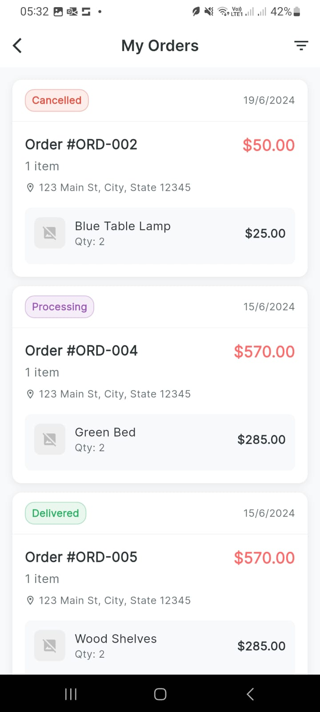

# Flutter I&C Technincal task

This repository contains the implementation of the technical evaluation task for the Flutter internship position. The goal was to build three user-profile screens using Flutter, GetX state management, MVVM architecture, and Firebase integration, along with an additional feature for sorting/filtering orders.

## ✨ Features

1. **Profile Screen**
   - Displays user name, email, and profile picture.
   - “Edit Profile” and “My Orders” buttons.
2. **Edit Profile Screen**
   - Allows updating user name.
   - Image picker integrated; upload logic in place.
3. **My Orders Screen**
   - Displays a list of previous orders (static/dummy data).
   - **Sorting & Filtering**: Custom feature to sort and filter orders for improved usability.
4. **State Management**
   - GetX for controllers, bindings, and reactive state.
5. **Architecture**
   - MVVM: clear separation of Model, View, ViewModel, and Controller.
6. **Reusable Components**
   - Common widgets for buttons, text fields, etc.
   - Centralized constants for colors, styles, and padding.

---

## 🖼️ Screenshots

| Profile Screen                      | Edit Profile Screen            | My Orders Screen            | Filter Orders            |
| -------------------------          | ------------------------------ | --------------------------- | --------------------------- |
|  |   |   | 

---

## 🏗️ Architecture

- **MVVM**: Models handle data, Views display UI, ViewModels manage UI logic, Controllers mediate between ViewModels and Views.
- **GetX**: Used for dependency injection (Bindings), routing, and reactive state.
- **Firebase**:
  - Firestore for storing user data.
  - Storage upload logic implemented, ready for activation.

---

